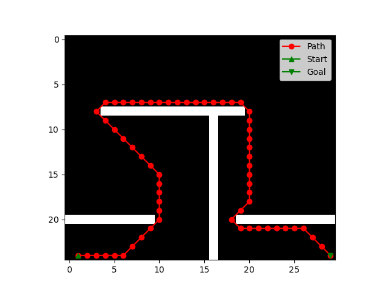

# Breadth-First Search of a 2D Array
This Python code implements the Breadth-First Search (BFS) algorithm for pathfinding on a 2D grid/map. BFS is an algorithm that explores all reachable nodes in a grid, making it suitable for finding the shortest path from a start point to a goal point. This function returns the shortest path or flags the map as unsolvable.

It was created as a sub-project of my Final Year Project on Genetic Algorithms at University to ensure that maps passed to the GA as training data were solvable.

## Features
- Solves pathfinding problems on maps represented as 2D bindary grids.
- Utilizes the BFS algorithm to explore the grid and find the shortest path.
- Handles obstacles on the map, ensuring the generated path avoids blocked areas.
- Check if a path from the start to the goal exists.

## Usage
The function itself requires the numpy and copy libraries, the usage examples also require matplotlib.

The function takes inputs in the form of a 2D map in the form of a binary array with 0 representing empty
space and 1 representing obstacles, goal coordinates, and start coordinates (in the form [row (or y), column (or x)]).

It returns a boolean term to show if the map is solvable, and if the map is solvable returns the shortest path.

There are two tutorials on how to use this function, both are identical except [this one](Example_Usage_Unsolvable_Map.py) uses an unsolvable map while [this one](Example_Usage_Solvable_Map.py) uses a solvable map.

Here is an example output of what a map and path plot would look like from [the solvable map example](Example_Usage_Solvable_Map.py):

## Contribution, Modification and Distribution

Feel free to use and modify this code for your pathfinding needs. If you encounter any issues or have suggestions for improvement, please open an issue or contribute to the repository. Happy pathfinding!

MIT License
Copyright (c) 2024 HarGrif
